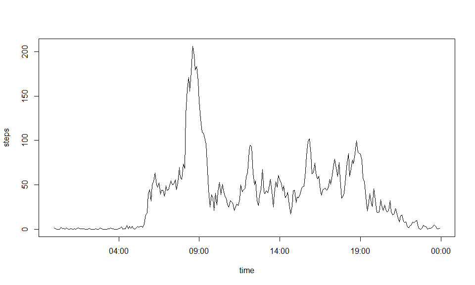
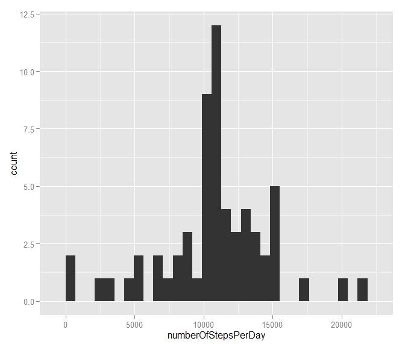

# Reproducible Research: Peer Assessment 1


## 1. Loading and preprocessing the data

The snippet "step1" performs loading of the activity monitorning data, and the snippet "step2-1" performs preprocessing of the data.


```r
data = read.csv("activity.csv");
```


## 2. What is mean total number of steps taken per day?

**2.1. Make a histogram of the total number of steps taken each day**

A variable named "numberOfStepsPerDay" is created. The vector "numberOfStepsPerDay" stores numer of steps taken on each day. The na.omit function is used to remove rows with incomplete cases, and the and qplot function is used to plot this histogram about total number of steps taken each day. 


```r
library(ggplot2)

data$steps = as.numeric(data$steps); 
dateStrings = unique(data$date)
numDates = length(dateStrings);

numberOfStepsPerDay = rep(0, numDates);

for (i in 1:numDates){
  dateString = dateStrings[i];
  correspondingRows = data[data$date == dateString, ];
  numberOfSteps = sum(correspondingRows[, 1]);
  numberOfStepsPerDay[i] = numberOfSteps;
}

numberOfStepsPerDay = na.omit(numberOfStepsPerDay);

qplot(numberOfStepsPerDay, geom="histogram")
```

```
## stat_bin: binwidth defaulted to range/30. Use 'binwidth = x' to adjust this.
```

 

**2.2. Calculate and report the mean and median total number of steps taken per day**

Execute "mean(numberOfStepsPerDay)", and then the obtained mean value is:

```r
mean(numberOfStepsPerDay)
```

```
## [1] 10766.19
```


Execute "median(numberOfStepsPerDay)", and then the obtained median value is:

```r
median(numberOfStepsPerDay)
```

```
## [1] 10765
```


## 3. What is the average daily activity pattern?

**3.1. Make a time series plot (i.e. type = "l") of the 5-minute interval (x-axis) and the average number of steps taken, averaged across all days (y-axis)**

The data frame 'oneDayData' with 288 rows contains the 288 5-minute intervals of a day and the average number of steps taken across all days. 


```r
library(ggplot2)

toTimeString <- function(value){
  if (value < 100){
    return ( paste("00:", value, ":00",  sep =""));
  } else {
    h = value %/% 100;
    m = value %% 100;
    return ( paste( h, ":", m, ":00",  sep =""));
  }
}

oneDayData = data[1:288, ];

for (i in 1 : 288){
  intvl = data[i, 3];
  theRows = data[data$interval == intvl & is.na(data$steps) == FALSE, ];
  meanOfSteps = mean(theRows[, 1]);
  oneDayData[i, 1] = meanOfSteps;
}

tempTime = rep("", 288);
for (i in 1 : 288){
  #tempTime[i] = toTimeString(data[i, 3]);
  tempTime[i] = paste( "2000-10-01", toTimeString(data[i, 3]) );
}

oneDayData[, "time"] = as.POSIXct(tempTime);

plot(steps ~ time, oneDayData, type = "l")
```

 

**3.2. Which 5-minute interval, on average across all the days in the dataset, contains the maximum number of steps? (What is the 5-minute interval that, on average, contains the maximum number of steps?)**


```r
intervalIndex = which.max(oneDayData$steps);
theInterval = data$interval[intervalIndex];

print(paste("The interval is:", theInterval))
```

```
## [1] "The interval is: 835"
```


So **the 5-minute interval at 08:35:00 in one day contains the maximum number of steps on average**.


## 4. Imputing missing values

**4.1. Calculate and report the total number of missing values in the dataset (i.e. the total number of rows with NAs)**

nrow (data[is.na(data$steps) == T, ]) is 2304, so the total number of rows with NAs is 2304.

**4.2. Devise a strategy for filling in all of the missing values in the dataset. The strategy does not need to be sophisticated. For example, you could use the mean/median for that day, or the mean for that 5-minute interval, etc.**

A strategy is like this: use the mean of all days at that time interval.

**4.3. Create a new dataset that is equal to the original dataset but with the missing data filled in.**

Using the code sippet below, 'data2' is a new dataset that is equal to the original dataset but with the missing data filled in


```r
data2 = data;
numRows = nrow(data2)
for (i in 1 : numRows){
  if (is.na(data2[i, 1])){
     interval = data[i, 3];
     index = which(oneDayData[, 3] == interval)
     data2[i, 1] = oneDayData[index, 1];
  }
}
```

**4.4. Make a histogram of the total number of steps taken each day and calculate and report the mean and median total number of steps taken per day. Do these values differ from the estimates from the first part of the assignment? What is the impact of imputing missing data on the estimates of the total daily number of steps?**


Vector 'numberOfStepsPerDay' stores total number of steps taken on all the days. Its length is the number of dates in the 'data2' data frame. 


```r
data2$steps = as.numeric(data2$steps); 
dateStrings = unique(data2$date)
numDates = length(dateStrings);
numberOfStepsPerDay = rep(0, numDates);

for (i in 1:numDates){
  dateString = dateStrings[i];
  correspondingRows = data2[data2$date == dateString, ];
  numberOfSteps = sum(correspondingRows[, 1]);
  numberOfStepsPerDay[i] = numberOfSteps;
}

qplot(numberOfStepsPerDay, geom="histogram")
```

```
## stat_bin: binwidth defaulted to range/30. Use 'binwidth = x' to adjust this.
```

 

This figure just above is a histogram of the total number of steps taken each day **after** missing values were imputed. "data2" is created by copying "data" and then filled with missing values. The value mean(numberOfStepsPerDay) is 10766.19, and the median is also 10766.19. 

The mean is the same, and the median is slightly different. The impact of imputing missing data is that the values are estimated values instead of real values, so they will seem not very real in certain circumstances.


## 5. Are there differences in activity patterns between weekdays and weekends?

In Date and Time Settings of Windows 7, it can be checked that 2012-10-01 is Monday. Thus, a simple rule can be designed to determine weekday or weekend.

**5.1. Create a new factor variable in the dataset with two levels, weekday and weekend, indicating whether a given date is a weekday or weekend day.**

The dataset 'data3' below is a new dataset added with an extra factor variable named "dateType", which indicates whether a given date is a weekday or weekend day. 


```r
data3 = data2;

numRows = nrow(data3);
weekdayOrWeekendVec = rep("", numRows)

# function to check weekend or weekday by date string
weekdayOrWeekend <- function (dateString){
  month_day = substr(dateString, 6, 10)
  month = substr(month_day, 1, 2);
  day = substr(month_day, 4, 5);
  value = as.numeric(day);
  value = value + (as.numeric(month) - 10) * 31;
  mod7 = (value+1) %% 7;
  return (ifelse(mod7 <= 1, "weekend", "weekday"));
}

for (i in 1:numRows){
  a = weekdayOrWeekend(data3$date[i]);
  weekdayOrWeekendVec[i] = a;
}

data3[, "dateType"] = as.factor(weekdayOrWeekendVec);
```


**5.2. Make a panel plot containing a time series plot (i.e. type = "l") of the 5-minute interval (x-axis) and the average number of steps taken, averaged across all weekday days or weekend days (y-axis). See the README file in the GitHub repository to see an example of what this plot should look like using simulated data.**

The plot below is an unsophisticated panel plot comparing the average number of steps taken per 5-minute interval across weekdays and weekends.


```r
weekendOnes = (data3$dateType == "weekend");
weekendData = data3[weekendOnes, ];     #data for the first time series plot 
weekdayData = data3[!(weekendOnes), ];  # data for the second time series plot

weekendData[, "five_minute_interval_on_weekends"] = weekendData$time;
weekdayData[, "five_minute_interval_on_weekdays"] = weekdayData$time;


par(mfrow = c(2, 1));

oneDayData_weekend = weekendData[1:288, ];
for (i in 1 : 288){
  interval = data[i, 3];
  theRows = weekendData[weekendData$interval == interval, ];
  meanOfSteps = mean(theRows$steps);
  oneDayData_weekend[i, 1] = meanOfSteps;
}

# "2000-10-01" is a dummy date here which helps to create calendar time objects for the five-minute intervals of a day.

tempTime = rep("", 288);
for (i in 1 : 288){
  tempTime[i] = paste( "2000-10-01", toTimeString(data[i, 3]) );
}
oneDayData_weekend[, "five_minute_interval_on_weekends"] = as.POSIXct(tempTime);


plot(steps ~ five_minute_interval_on_weekends, oneDayData_weekend, type = "l");


oneDayData_weekday = weekdayData[1:288, ];
for (i in 1 : 288){
  interval = data[i, 3];
  theRows = weekdayData[weekdayData$interval == interval, ];
  meanOfSteps = mean(theRows$steps);
  oneDayData_weekday[i, 1] = meanOfSteps;
}

tempTime = rep("", 288);
for (i in 1 : 288){
  tempTime[i] = paste( "2000-10-01", toTimeString(data[i, 3]) );
}
oneDayData_weekday[, "five_minute_interval_on_weekdays"] = as.POSIXct(tempTime);

plot(steps ~ five_minute_interval_on_weekdays, oneDayData_weekday, type = "l")
```

 

The panel plot above contains two time series subplots and compares the average number of steps in different 5-minute intervals of a day on weedays and weekends respectively.  

Are there differences in activity patterns between weekdays and weekends? **The plot shows that there are obvious differences in activity patterns between weekdays and weekends.** The average steps between 09:00 and 19:00 are much smaller on weekdays than on weekends. 

